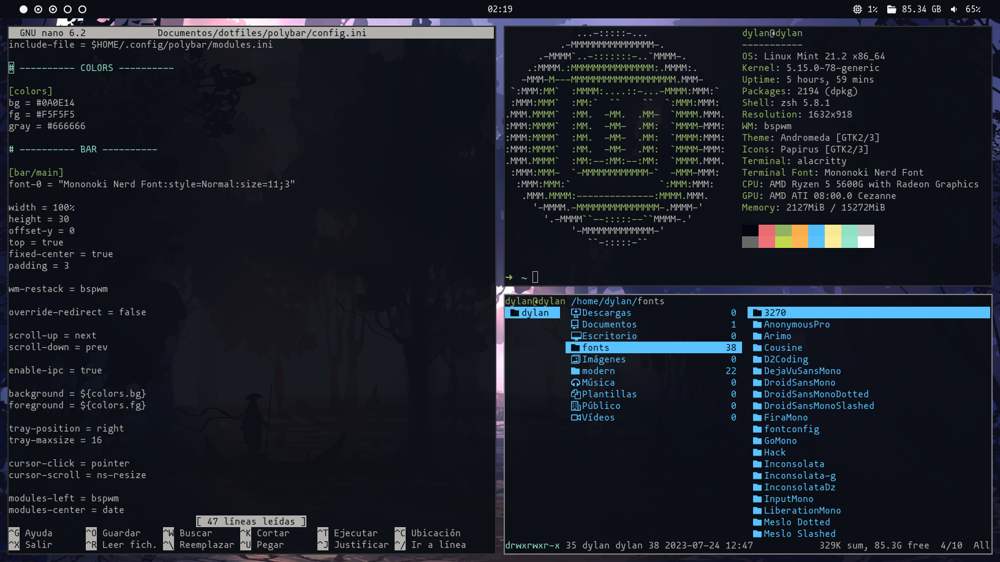

# Dotfiles & Configs

- **Operating System** - linux mint
- **Window Manager** - bspwm
- **Terminal** - alacritty
- **Shell** - zsh
- **Bar** - polybar
- **Launcher** - rofi
- **File Manager** - ranger

